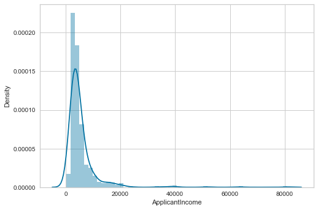
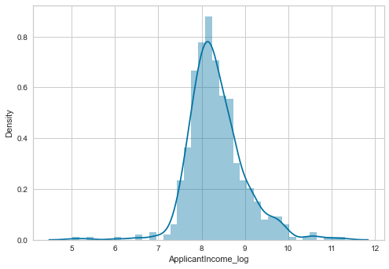
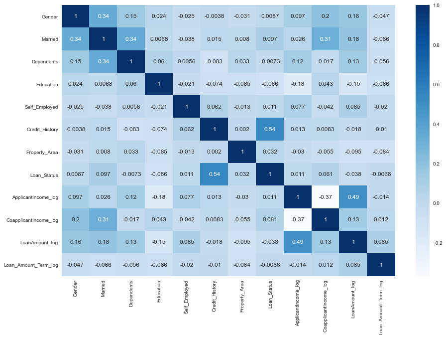
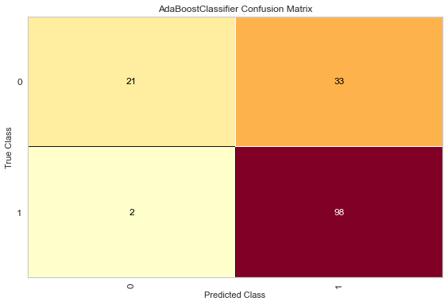
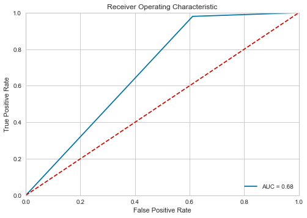

# Loan Approval Prediction

#### Problem Statement:
   • Company wants to automate the loan eligibility process based on customer details provided while filling online application form. 
   • These detail are Gender, Marital Status, Education, Number of Dependents, Income, Loan Amount, Credit History, etc.

## Project Overview 
• The objective of this project is to create a machine learning model that **predicts whether loan of customer would be approved or not based on the features like Income, Number of Dependents, etc.**  
• This project **helps to automate the loan eligibility process.**  
• The dataset for the project is taken from Kaggle.

## Resources Used
• Packages: **pandas, numpy, sklearn, matplotlib, seaborn.** 
• Dataset: https://www.kaggle.com/altruistdelhite04/loan-prediction-problem-dataset  

## Exploratory Data Analysis (EDA)
• **Removed unwanted columns**: 'Loan_ID' 
• **Plotted bargraphs and countplots** for categorical and numerical features respectively to analyze data distrubution 
• In some numerical features, data distribution was **right skewed**. Used **Log transformation** to make those features to **normally distributed**.

  

• For **Numerical Features** : **Replaced NaN values with mean** 
• For **Categorical Feature** (Credit_History): **Replaced NaN values with mode** 
• **Handling ordinal and nominal categorical features** 
• Feature Selection using **correlation matrix** 

 

## Model Building and Evaluation
Metrics: Accuracy, Confusion Matrix and ROC Curve  
• Got best accuracy of 77.27 for Ada Boost Classifier.

 

