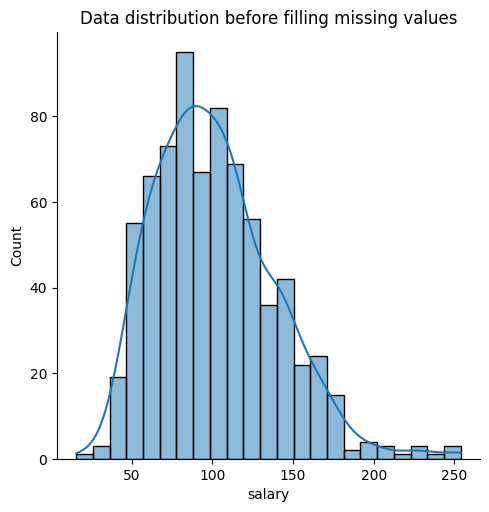
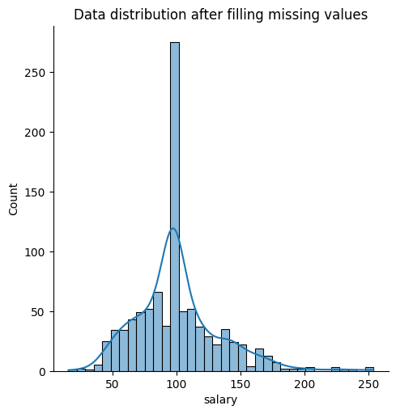
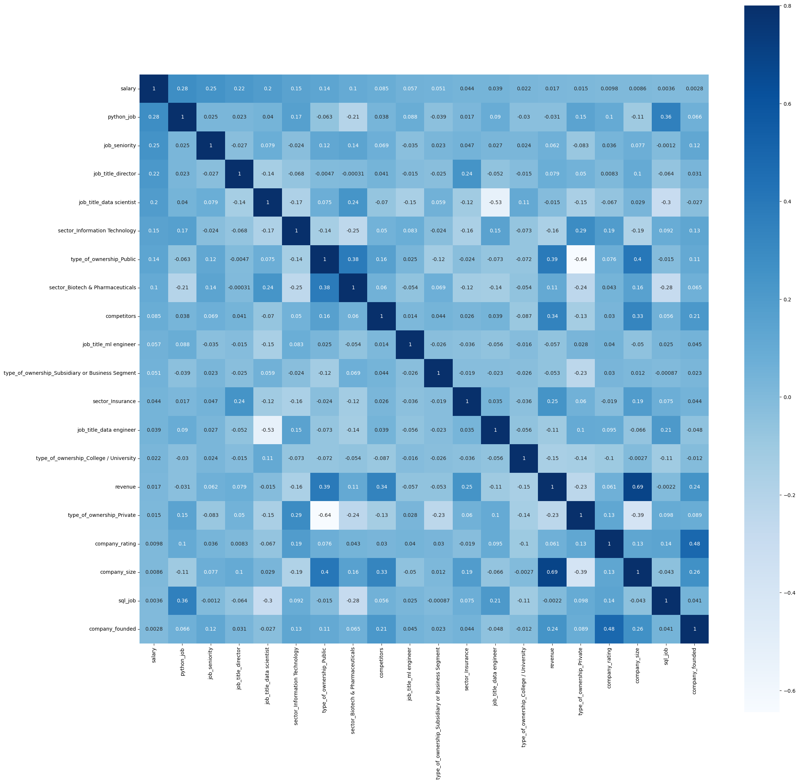
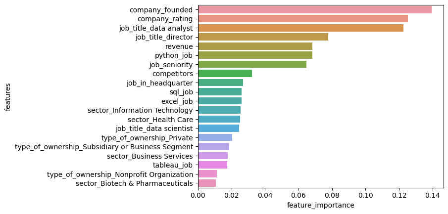
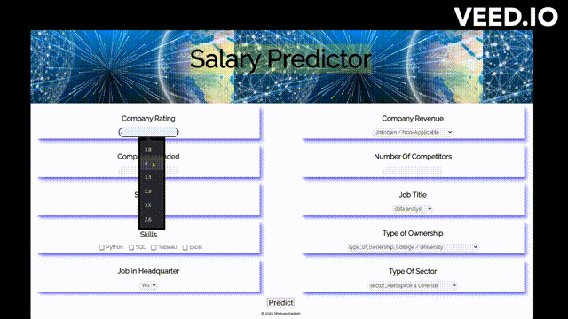

# Data Science Salary Prediction

## Project Overview
• Created a machine learning model that **estimates salary of data scientist based on the features like rating, company_founded, etc.** 
• This project **helps data scientist/analyst to negotiate their income for an existing or a new job** 
• Built a flask API endpoint that was hosted on a local webserver. The API endpoint takes in a request with features and returns an estimated salary.

## Resources Used
• Packages: **pandas, numpy, sklearn, matplotlib, seaborn, Flask.** 
• Dataset: https://github.com/PlayingNumbers/ds_salary_proj/blob/master/glassdoor_jobs.csv  

## Exploratory Data Analysis (EDA)
• **Removed unwanted columns**: 'Unnamed: 0' 
• **Plotted bargraphs and countplots** for numerical and categorical features respectively for EDA 
• **Numerical Features** (Rating, Founded,Salary): **Replaced NaN or -1 values with mean or meadian based on their distribution** 

  

• **Categorical Features: Replaced NaN or -1 values with 'Other'/'Unknown' category** 
• **Removed unwanted alphabet/special characters from Salary feature** 
• **Converted the Salary column into one scale** i.e from (per hour, per annum, employer provided salary) to (per annum)

## Feature Engineering
• **Creating new features** from existing features e.g. **job_in_headquaters from (job_location, headquarters)**, etc. 
• Trimming columns i.e. **Trimming features having more than 10 categories to reduce the dimensionality** 
• **Handling ordinal and nominal categorical features** 
• Feature Selection using **correlation matrix** 

 

• Feature Scaling using **StandardScalar**

## Model Building and Evaluation
Metric: Root Mean Squared Error (RMSE) 
• Multiple Linear Regression: 25.911 
• Lasso Regression: 26.379 
• **Random Forest: 19.050** 

## Feature Importance

## Model Prediction

